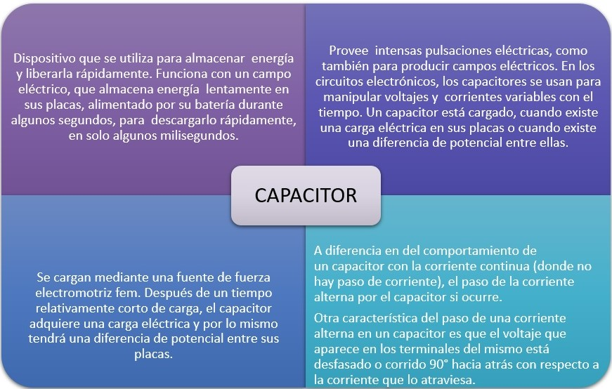
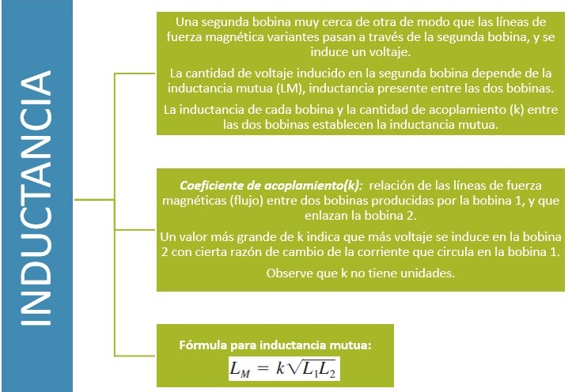
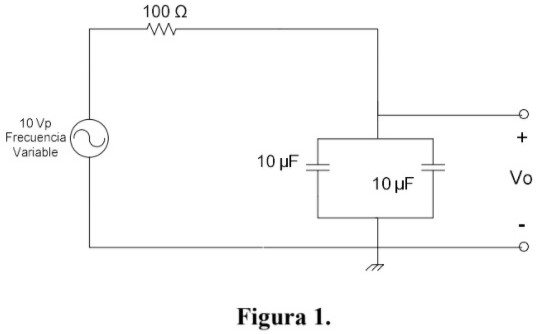
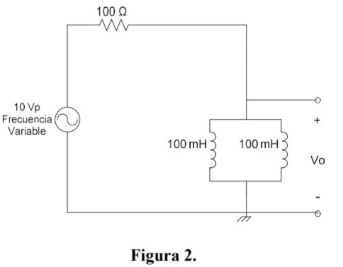
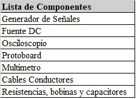

# Informe-8
Práctica de Laboratorio 8

1. OBJETIVOS

_Objetivo General_

• Estudiar los circuitos RC y RL, verificar la relación que tienen los voltajes medidos con el multímetro y el osciloscopio utilizando una fuente de voltaje alterno. Mediante el uso de un simulador de circuitos electrónicos. Escribir los datos adquiridos  en tablas y posteriormente analizar los resultados de acuerdo a la teoría vista en clases.

_Objetivos Específicos_

• Verificar el comportamiento de la bobina y el capacitor en circuitos DC. 

• Verificar el comportamiento de la bobina y el capacitor en circuitos AC. 

• Verificar las combinaciones serie y paralelo de bobinas y capacitores. 

• Familiarizarse con el uso de instrumentos de medida.

2.MARCO TEÓRICO

3.DIAGRAMAS

_Diagrama 1:_

_Diagrama 2:_

4.LISTA DE COMPONENTES

5.EXPLICACIÓN 

7.- Construya en el protoboard el circuito mostrado en la Figura 1.

Circuito  armado en MULTISIM conectado el osciloscopio para determinar valores pico

Circuito armado en MULTISIM conectado al voltimetro para determinar el Voltaje (rms)

Circuito armado en MULTISIM conectado al amperimetro para determinar la corriente que pasa por la resistencia

2.- Construya el circuito mostrado en la Figura 2

Circuito armado en MULTISIM conectado el osciloscopio para determinar valores pico

Circuito armado en MULTISIM conectado al voltimetro para determinar el voltaje (rms)

Circuito armado en MULTISIM conectado al amperimetro para determinar la corriente que pasa por la resistencia

•	Análisis de resultados

1.- Para cada uno de los circuitos anteriores, elabore una tabla con los resultados de las
diferentes mediciones de voltaje realizadas con el osciloscopio y multímetro. Compare y
comente los resultados obtenidos tomando en cuenta las distintas frecuencias utilizadas.

Tabla Figura 1

Se puede observar en las tablas que los valores recolectados que los datos son inversamente proporcionales ya que en el circuito con capacitancias  se puede ver que el voltaje  pico y el voltaje rms decrecen y que además la corriente va en aumento, por otro lado en el circuito resistivo el voltaje pico y el voltaje rms  crecen cada vez que se aumenta la frecuencia  y que la corriente  va disminuyendo cada vez que se aumenta la frecuencia.

•	Preguntas

1.- ¿Cómo se comportan la bobina y el capacitor en corriente continua (cero Hz)

•	Los capacitores en un circuito de corriente continua pasan por dos fases conocidas como fase de transición y fase de continua.  En la fase de estabilización, se producen los fenómenos que se describen en las curvas de carga del capacitor hasta que se estabiliza y pasa a estar en fase continua, en esta fase la intensidad de corriente que atravesaría el capacitor es igual a cero entonces se lo toma como una “rama abierta” en el circuito.

•	En los inductores al ser la corriente constante la caída de tensión sobre ellos es igual a cero, por lo que lo interpretamos como simplemente un “cable” en el circuito.

2.- ¿Cómo se comportan la bobina y el capacitor en corriente alterna?

•	En corriente alterna la capacitancia se comporta de forma distinta que, con la corriente continua, mientras en esta los condensadores se tratan como circuitos abiertos cuando se cargan y no dejan circular la corriente, en alterna no ocurre esto, sino que se tratan como si fueran circuitos cerrados.

•	Una   bobina   en   una   corriente alterna, introduce   una   oposición denominada   reactancia   inductiva “XL” la   misma   que   es directamente   proporcional   al coeficiente   de   autoinducción (L), cuyo valor se mide en henrios (H), y a la pulsación de la corriente. El ángulo   de   fase   de   la   bobina   en corriente alterna es de 90°. Al   permanecer   constante   la tensión   en   los   extremos   de   la bobina, no   tienen   lugar   en   ella fenómenos de autoinducción y en consecuencia   se   comporta   como un cortocircuito. 

3.- ¿Qué cree usted que ocurriría con el voltaje Vo y la corriente de la resistencia en los
circuitos analizados en esta práctica, si se utilizan dos bobinas o dos capacitores de valores
distintos?

Lo único que pasaría en que los valores Vo varíen en función de que tanto se altere el valor de la impedancia.
Si la impedancia capacitiva o resistiva resulta ser menor, la caída de tensión en Vo sería menor y si resulta mayor, la caída de tensión en Vo sería mucho mayor.

4.- ¿Qué son los valores eficaces de voltaje y corriente?

Los valores eficaces de corriente y voltaje son aquellos valores equivalentes en corriente continua es decir tendrá el mismo comportamiento respecto a potencia suministrada en el circuito.

6.CONCLUSIONES:

•	AL observar los valores de la tablas se puede determinar que los valores pico, voltaje rms y la corriente  son 0 cuando la frecuencia de la fuente de voltaje tiene un valor de 0, esto se debe al comportamiento de reactancias y capacitancia en corriente directa.

• Es posible representar la impedancia para cada una de las frecuencias asociadas en los  dos  circuitos  como  un  número  complejo  donde  predomina  en  un  caso  la impedancia capacitiva y en el otro caso la impedancia inductiva Z =R +j(Xl - Xc). 

• Utilizar la impedancia Z nos permite realizar cálculos utilizando la ley de ohm para los cálculos. 

• El valor de la caída de tensión medida con el multímetro corresponde al valor eficaz de la caída de tensión media con el osciloscopio.

• Mientras mayor sea la frecuencia la impedancia capacitiva será menor.   Mientras mayor sea la frecuencia la impedancia inductiva será mayor.

 
7.BIBLIOGRAFÍA

• Floyd Thomas L, “Principios de Circuitos Eléctricos”, 8 ed. 2007 .Pearson Educación de México, S.A. de C.V. México, pp. 281-333.

• .Cazar, M. (2019, 18 febrero). Comportamiento de una bobina en corriente continua y en corriente alterna. Prezi.Com. https://prezi.com/p/ofvyyubqitlz/comportamiento-de-una-bobina-en-corriente-continua-y-en-corriente-alterna/?frame=d00d5b29b8e7fd597b45960609c0e460377e46ea

*Bobinas [Witronica]. (2019, 25 enero). Witronica. http://witronica.com/componentes:bobina

• Morales, J. A. R. (2020, 31 agosto). Funcionamiento del condensador. PASIÓN ELECTRÓNICA. https://pasionelectronica.com/funcionamiento-del-condensador/

